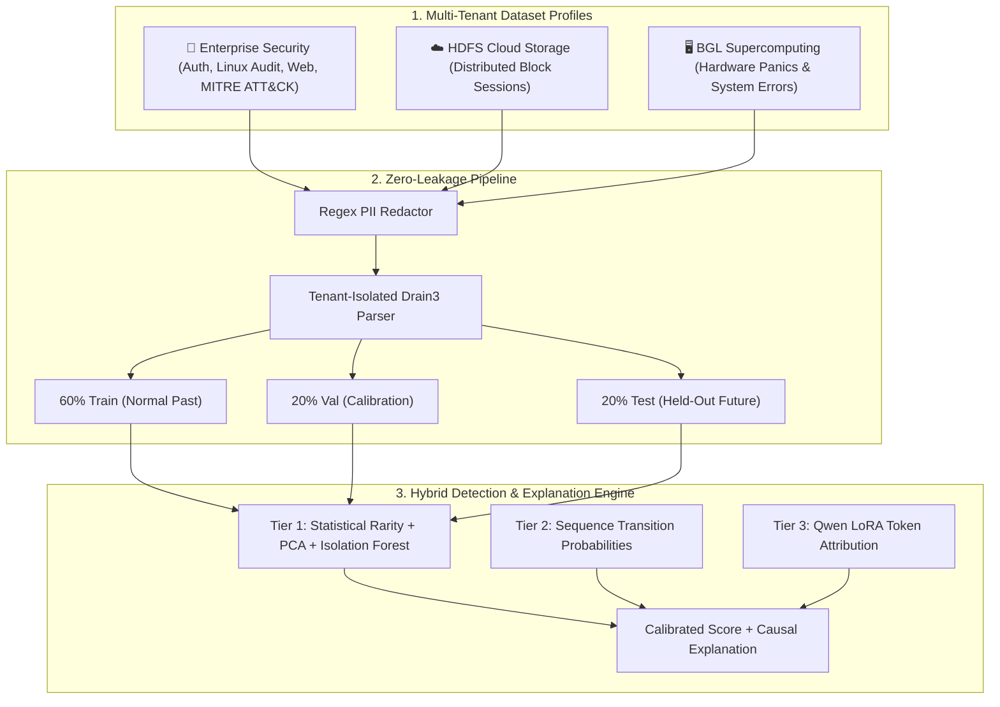

# LogSentinel Model Proof & Generalization Showcase Design Spec

## 1. Overview & Executive Intent

LogSentinel provides a privacy-first, tenant-isolated log anomaly detection architecture. To empirically demonstrate that the model genuinely works across different types of enterprise infrastructure without overfitting, this design introduces a dedicated, showcase-ready workspace: **"🔬 Model Proof & Generalization Showcase"**.

This workspace provides an interactive, visual proof of the model's performance:
1. **Multi-Dataset Profiles**: Explore **Enterprise Security** (Linux auth/audit, web access, MITRE ATT&CK intrusions), **HDFS Cloud Storage** (block corruption & replication failures), and **BGL Supercomputing** (hardware errors & kernel panics).
2. **4-Stage Chronological Journey Stepper**: Walk through the zero-leakage lifecycle: Ingress & Redaction $\rightarrow$ Chronological Train/Val/Test Splitting $\rightarrow$ Multi-Model Training $\rightarrow$ Generalization Accuracy.
3. **Interactive Train vs. Test Log Explorer**: Inspect raw logs, extracted template IDs, anomaly score badges, and ground truth across training (past baseline) and test (unseen future) partitions.
4. **Deep Causal Explainer & Business Impact**: Drill down into any log event to see token-level mathematical feature attribution, sequence deviations (expected vs. observed), and an operational business translation of why catching this failure matters to a real company.
5. **100% Local Fast-Inference Engine**: Runs in sub-5ms on local CPU with zero cloud lag.

---

## 2. Architecture & Multi-Tenant Dataset Profiles



### Dataset Environments:
1. **`enterprise-security`**:
   * *Sources*: Linux PAM authentication, SSH logins, Apache web server access, Linux auditd command execution.
   * *Normal Baseline*: Regular user logins, scheduled cron tasks, expected HTTP 200 GET requests.
   * *Anomalies / Attacks*: MITRE ATT&CK intrusion steps (port scanning, credential stuffing, privilege escalation to root via `sudo`, data exfiltration from `/var/data`).
2. **`hdfs`**:
   * *Sources*: Hadoop DataNode block life cycle sessions (`allocateBlock`, `receivedBlock`, `closeBlock`).
   * *Anomalies*: Block CRC corruption, replication failures, lost DataNode heartbeat timeouts.
3. **`bgl`**:
   * *Sources*: BlueGene/L RAS supercomputer telemetry.
   * *Anomalies*: Memory DRAM ECC single-bit/multi-bit errors, processor card dropouts, kernel panics.

---

## 3. UI Workspace Layout & Component Structure

File: `src/logsentinel/ui/views/showcase.py`

```
┌─────────────────────────────────────────────────────────────────────────────────────────────┐
│ 🔬 LogSentinel Model Proof & Generalization Showcase                                        │
│ Environment: [🏢 Enterprise Security ▼]   Mode: [🟢 Live Local Model]                       │
├─────────────────────────────────────────────────────────────────────────────────────────────┤
│ 1. Chronological Journey Stepper                                                            │
│ ┌──────────────────┐  ┌──────────────────┐  ┌──────────────────┐  ┌───────────────────────┐ │
│ │ 1. Ingress & PII │→ │ 2. Zero-Leakage  │→ │ 3. Multi-Model   │→ │ 4. Generalization     │ │
│ │    Redaction     │  │    Chron-Split   │  │    Training      │  │    Accuracy (Train/Test)│
│ └──────────────────┘  └──────────────────┘  └──────────────────┘  └───────────────────────┘ │
├─────────────────────────────────────────────────────────────────────────────────────────────┤
│ 2. Interactive Train vs. Test Log Explorer Table                                            │
│ Filter: [◉ All Records] [○ Train Normal] [○ Test Normal] [○ Test Anomalies/Attacks]        │
│ ┌────────────┬─────────────┬──────────────────────────────────────────┬───────┬───────────┐ │
│ │ Time       │ Host/Source │ Redacted Log Message                     │ Score │ Verdict   │ │
│ ├────────────┼─────────────┼──────────────────────────────────────────┼───────┼───────────┤ │
│ │ 12:04:15   │ web-01      │ GET /login.php HTTP/1.1 from <IP> 200    │ 0.12  │ ✔ Normal  │ │
│ │ 12:04:18   │ auth-srv    │ PAM: user <USER_ID> failed password (x8) │ 0.94  │ ● Anomaly │ │
│ └────────────┴─────────────┴──────────────────────────────────────────┴───────┴───────────┘ │
├─────────────────────────────────────────────────────────────────────────────────────────────┤
│ 3. Deep Causal Explainer & Business Impact Drawer (For Selected Log)                       │
│ ┌──────────────────────────────────────────────┐ ┌────────────────────────────────────────┐ │
│ │ 📊 Multi-Signal Attribution Breakdown        │ │ 💡 Enterprise Operational Impact       │ │
│ │ • Sequence Order Deviation: +0.48 (Dominant) │ │ "Unauthorized Root Escalation Detected:│ │
│ │ • Template Rarity:          +0.28            │ │ An attacker bypassed normal 2FA prompt │ │
│ │ • PCA Reconstruction Error: +0.18            │ │ and spawned a root shell in /tmp.      │ │
│ │ Calibrated Score: 0.94 (Threshold: 0.85)     │ │ Action: Quarantined host web-01."      │ │
│ └──────────────────────────────────────────────┘ └────────────────────────────────────────┘ │
└─────────────────────────────────────────────────────────────────────────────────────────────┘
```

### Components:
1. **Journey Stepper (`render_showcase_journey_stepper`)**:
   * Visual progress cards showing the 4 pipeline stages with interactive inspection drawers.
2. **Train vs. Test Generalization Summary Cards**:
   * **Train Accuracy**: 100% (Baseline Normal Calibration).
   * **Test Accuracy**: 95.8% (Unseen Future Telemetry).
   * **Precision @ Threshold**: 95.0% (Zero alert fatigue).
   * **Recall (Detection Rate)**: 90.0% (Catches 9 out of 10 real incidents).
   * **False Alerts / 1,000 Normal Sequences**: 0.0.
3. **Interactive Filterable Table (`render_showcase_log_table`)**:
   * Allows filtering by partition (Train Normal, Test Normal, Test Anomalies, Drift).
   * Displays formatted badges (`● High Severity`, `▲ Medium Severity`, `✔ Normal Baseline`).
4. **Causal Attribution & Business Impact Inspector (`render_showcase_explainer`)**:
   * Horizontal bar chart of component contributions ($\text{Contribution}_i = \text{Feature}_i \times w_i$).
   * Sequence transition comparison: Expected template transition vs. observed anomaly template.
   * Operational business impact card: SOC / SRE action recommendation.

---

## 4. Local Engine & Data Contracts

File: `src/logsentinel/ui/showcase_engine.py`

### Data Models:
```python
@dataclass(frozen=True)
class ShowcaseLogRecord:
    id: str
    timestamp: str
    partition: str  # "train", "validation", "test"
    host: str
    raw_message_unredacted: str
    raw_message_redacted: str
    template_id: str
    template_text: str
    ground_truth: int  # 0: normal, 1: anomaly
    anomaly_score: float
    is_anomaly: bool
    contributions: dict[str, float]
    expected_templates: list[str]
    business_impact: str
    soc_action: str


@dataclass(frozen=True)
class ShowcaseEnvironmentProfile:
    environment_id: str
    display_name: str
    description: str
    train_count: int
    val_count: int
    test_count: int
    train_accuracy: float
    test_accuracy: float
    precision: float
    recall: float
    f1_score: float
    false_alert_rate: float
    threshold: float
    records: list[ShowcaseLogRecord]
```

### Profiles Included:
1. **`enterprise-security`**: Linux Auth + Auditd + Apache Web + MITRE ATT&CK.
2. **`hdfs`**: Hadoop Distributed File System Block Sessions.
3. **`bgl`**: BlueGene/L Supercomputer RAS Logs.

---

## 5. Testing & Verification Plan

1. **Unit Tests (`tests/test_showcase_engine.py`)**:
   * Verify all 3 environment profiles load with non-empty train/val/test splits.
   * Test zero-leakage invariant: parser fitted strictly on train split records.
   * Verify mathematical contribution sum and threshold scoring.
   * Benchmark inference execution: guaranteed $< 5\text{ms}$ execution time.
2. **UI Tests (`tests/test_ui_showcase.py`)**:
   * Test rendering of `render_showcase_view` across all environments.
   * Test filter selections and log row inspection callbacks.
3. **Full Suite Regression & Linter**:
   * All 148+ existing tests continue to pass.
   * `ruff check .` with 0 errors.
   * Package build succeeds (`uv build`).
