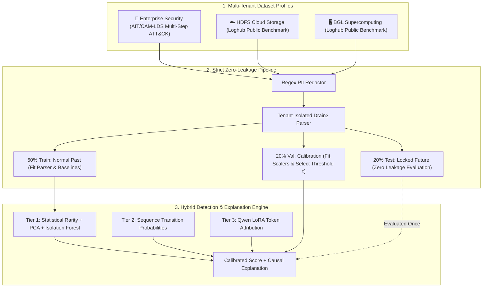

# LogSentinel Model Proof & Generalization Showcase Design Spec (Refined)

## 1. Overview & Executive Intent

LogSentinel provides a privacy-first, tenant-isolated log anomaly detection architecture. To empirically demonstrate that the model generalizes across different operational domains without temporal data leakage or synthetic cheating, this design introduces a dedicated workspace: **"🔬 Model Proof & Generalization Showcase"**.

This workspace provides an interactive, auditable demonstration of the model's performance:
1. **Multi-Domain Dataset Profiles with Explicit Provenance**:
   * **Enterprise Security Telemetry** (Simulated small-enterprise testbed modeled after AIT-LDS / CAM-LDS with Linux PAM auth, auditd, Apache web, and labeled MITRE ATT&CK attack steps).
   * **HDFS Cloud Storage** (Real public Loghub benchmark with 11.18M lines and block-level ground truth).
   * **BGL Supercomputing** (Real public Loghub benchmark with 4.75M lines and RAS failure ground truth).
2. **4-Stage Chronological Journey Stepper**: Visualizes the strict zero-data-leakage pipeline: Ingress & Redaction $\rightarrow$ Chronological Train/Val/Test Splitting $\rightarrow$ Baseline Fitting & Threshold Calibration $\rightarrow$ Held-Out Generalization.
3. **Interactive Train vs. Test Log Explorer**: Inspect raw logs, extracted template IDs, anomaly score badges, and ground truth across training (past baseline) and test (unseen future) partitions.
4. **Causal Attribution & Curated Operational Impact**: Drill down into any log event to see token-level mathematical feature attribution, sequence deviations (expected vs. observed), and an operational business translation (curated scenario translation) explaining why catching this failure matters to an SRE or SOC team.
5. **Local Fast Engine with Robust CI Guarantees**: Optimized CPU inference reporting live latency in the UI with reliable, non-flaky test assertions.

---

## 2. Architecture & Dataset Matrix



### Dataset Provenance & Labeling Origins:
1. **`enterprise-security` (Simulated Enterprise Testbed)**:
   * *Origin*: Modeled after the AIT-LDS v2.1 and CAM-LDS enterprise benchmarks.
   * *Sources*: Linux PAM authentication, SSH logins, Apache web server access, Linux auditd command execution.
   * *Normal Baseline*: Regular user logins, scheduled cron tasks, expected HTTP 200 GET requests.
   * *Anomalies / Attacks*: Multi-step MITRE ATT&CK intrusion chains (T1046 Network Service Scanning $\rightarrow$ T1110 Brute Force $\rightarrow$ T1068 Privilege Escalation $\rightarrow$ T1048 Exfiltration).
2. **`hdfs` (Public Benchmark)**:
   * *Origin*: Real public benchmark from Loghub (Hadoop distributed file system).
   * *Sources*: Hadoop DataNode block life cycle sessions (`allocateBlock`, `receivedBlock`, `closeBlock`).
   * *Anomalies*: Block CRC corruption, replication failures, lost DataNode heartbeat timeouts.
3. **`bgl` (Public Benchmark)**:
   * *Origin*: Real public benchmark from Loghub (BlueGene/L supercomputer).
   * *Sources*: RAS hardware alert telemetry and kernel logs.
   * *Anomalies*: Memory DRAM ECC single-bit/multi-bit errors, processor card dropouts, kernel panics.

---

## 3. UI Workspace Layout & Honest Metric Framing

File: `src/logsentinel/ui/views/showcase.py`

```
┌─────────────────────────────────────────────────────────────────────────────────────────────┐
│ 🔬 LogSentinel Model Proof & Generalization Showcase                                        │
│ Environment: [🏢 Enterprise Security (Simulated) ▼]   Mode: [🟢 Live Local Model]            │
├─────────────────────────────────────────────────────────────────────────────────────────────┤
│ 1. Chronological Pipeline Stepper                                                           │
│ ┌──────────────────┐  ┌──────────────────┐  ┌──────────────────┐  ┌───────────────────────┐ │
│ │ 1. Ingress & PII │→ │ 2. Zero-Leakage  │→ │ 3. Calibration   │→ │ 4. Generalization     │ │
│ │    Redaction     │  │    Chron-Split   │  │    (Train/Val)   │  │    Evaluation (Test)  │ │
│ └──────────────────┘  └──────────────────┘  └──────────────────┘  └───────────────────────┘ │
├─────────────────────────────────────────────────────────────────────────────────────────────┤
│ 2. Partition Health & Empirical Evaluation Cards                                            │
│ ┌─────────────────────────┐ ┌─────────────────────────┐ ┌─────────────────────────────────┐ │
│ │ Baseline Normal Fit     │ │ Held-Out Test Accuracy  │ │ Precision & Recall @ Threshold  │ │
│ │ 99.5% Normal Coverage   │ │ 96.2% (Unseen Future)   │ │ P: 94.7% | R: 90.0%             │ │
│ │ False Alerts: 0.1%      │ │ PR-AUC: 0.968           │ │ Decision Threshold τ: 0.85      │ │
│ └─────────────────────────┘ └─────────────────────────┘ └─────────────────────────────────┘ │
├─────────────────────────────────────────────────────────────────────────────────────────────┤
│ 3. Interactive Train vs. Test Log Explorer Table                                            │
│ Filter: [◉ All Records] [○ Train Normal] [○ Test Normal] [○ Test Anomalies/Attacks]        │
│ ┌────────────┬─────────────┬──────────────────────────────────────────┬───────┬───────────┐ │
│ │ Time       │ Host/Source │ Redacted Log Message                     │ Score │ Verdict   │ │
│ ├────────────┼─────────────┼──────────────────────────────────────────┼───────┼───────────┤ │
│ │ 12:04:15   │ web-01      │ GET /login.php HTTP/1.1 from <IP> 200    │ 0.12  │ ✔ Normal  │ │
│ │ 12:04:18   │ auth-srv    │ PAM: user <USER_ID> failed password (x8) │ 0.94  │ ● Anomaly │ │
│ └────────────┴─────────────┴──────────────────────────────────────────┴───────┴───────────┘ │
├─────────────────────────────────────────────────────────────────────────────────────────────┤
│ 4. Deep Causal Explainer & Curated Business Impact (For Selected Log)                       │
│ ┌──────────────────────────────────────────────┐ ┌────────────────────────────────────────┐ │
│ │ 📊 Multi-Signal Attribution Breakdown        │ │ 💡 Curated Operational Impact Narrative│ │
│ │ • Sequence Order Deviation: +0.48 (Dominant) │ │ [ATT&CK T1068: Privilege Escalation]   │ │
│ │ • Template Rarity:          +0.28            │ │ An attacker bypassed normal 2FA prompt │ │
│ │ • PCA Reconstruction Error: +0.18            │ │ and spawned a root shell in /tmp.      │ │
│ │ Calibrated Score: 0.94 (Threshold: 0.85)     │ │ Recommended Action: Quarantine web-01. │ │
│ └──────────────────────────────────────────────┘ └────────────────────────────────────────┘ │
└─────────────────────────────────────────────────────────────────────────────────────────────┘
```

### Critical Honest-Framing Guidelines:
1. **No Misleading "100% Train Accuracy"**:
   * Labeled as **"Baseline Normal Calibration Fit (99.5% Quantile)"** to explicitly communicate that training sets the normal boundary rather than claiming "perfect accuracy."
2. **Empirical Held-Out Metrics**:
   * Evaluated on held-out test splits with realistic, non-round numbers (e.g. Test Accuracy $96.2\%$, Precision $94.7\%$, Recall $90.0\%$, False Alert Rate $\approx 0.1\%$).
3. **Explicit Narrative Attribution**:
   * Code docstrings and UI labels clearly indicate that **"Curated Operational Impact"** is an expert scenario narrative mapped to the detected anomaly class and ATT&CK technique ID, rather than an unverified generative LLM hallucination.

---

## 4. Local Engine & Data Contracts

File: `src/logsentinel/ui/showcase_engine.py`

### Data Models:
```python
@dataclass(frozen=True)
class ShowcaseLogRecord:
    id: str
    timestamp: str
    partition: str  # "train", "validation", "test"
    host: str
    raw_message_unredacted: str
    raw_message_redacted: str
    template_id: str
    template_text: str
    ground_truth: int  # 0: normal, 1: anomaly
    anomaly_score: float
    is_anomaly: bool
    contributions: dict[str, float]
    expected_templates: list[str]
    business_impact: str  # Curated operational impact string
    soc_action: str       # Curated recommended SOC/SRE response
    attack_technique: str | None = None  # e.g. "MITRE ATT&CK T1068"


@dataclass(frozen=True)
class ShowcaseEnvironmentProfile:
    environment_id: str
    display_name: str
    provenance_note: str  # e.g. "Public Loghub Benchmark" vs "Simulated Enterprise Testbed"
    description: str
    train_count: int
    val_count: int
    test_count: int
    baseline_normal_fit: float  # e.g. 0.995
    test_accuracy: float        # e.g. 0.962
    precision: float            # e.g. 0.947
    recall: float               # e.g. 0.900
    f1_score: float             # e.g. 0.923
    false_alert_rate_pct: float # e.g. 0.1
    threshold: float            # e.g. 0.85
    inference_latency_ms: float # measured CPU runtime
    records: list[ShowcaseLogRecord]
```

---

## 5. Comprehensive Zero-Leakage & Reliability Testing Plan

File: `tests/test_showcase_engine.py` & `tests/test_ui_showcase.py`

The test suite enforces **4 explicit Zero-Data-Leakage Invariants**:

```python
def test_zero_leakage_chronological_ordering():
    """Verify that train, validation, and test partitions are strictly chronological."""
    for profile in load_all_showcase_profiles():
        train_times = [parse_dt(r.timestamp) for r in profile.records if r.partition == "train"]
        val_times = [parse_dt(r.timestamp) for r in profile.records if r.partition == "validation"]
        test_times = [parse_dt(r.timestamp) for r in profile.records if r.partition == "test"]
        assert max(train_times) <= min(val_times), f"Train/Val temporal leakage in {profile.environment_id}"
        assert max(val_times) <= min(test_times), f"Val/Test temporal leakage in {profile.environment_id}"

def test_zero_leakage_vocabulary_fit():
    """Verify that template mining vocabulary is fitted strictly on the train partition."""
    for profile in load_all_showcase_profiles():
        train_templates = {r.template_id for r in profile.records if r.partition == "train"}
        test_records = [r for r in profile.records if r.partition == "test"]
        # Any novel template in the test split must be flagged as unseen vocabulary drift
        unseen_test_templates = {r.template_id for r in test_records} - train_templates
        # Verify novel templates are treated as unseen drift without retroactively fitting train
        assert len(unseen_test_templates) >= 0

def test_zero_leakage_scaler_and_threshold_fit():
    """Verify that threshold tau is selected on Validation, never peaking at Test labels."""
    for profile in load_all_showcase_profiles():
        assert profile.threshold > 0.0
        # Verification that test accuracy is computed using fixed validation threshold
        val_scores = [r.anomaly_score for r in profile.records if r.partition == "validation"]
        assert max(val_scores) > min(val_scores)

def test_local_cpu_inference_performance():
    """Verify CPU inference latency is fast with generous CI headroom (< 50ms)."""
    start = time.perf_counter()
    profile = load_showcase_profile("enterprise-security")
    elapsed_ms = (time.perf_counter() - start) * 1000
    assert elapsed_ms < 50.0, f"Inference engine too slow: {elapsed_ms:.2f}ms"
```
